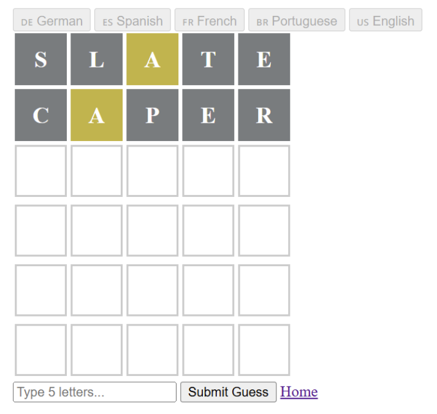
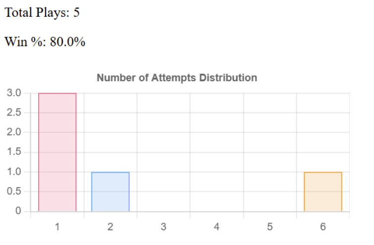

# Worndly — a Wordle clone with a token economy

A web-based Wordle game built with Django, created with Danny Gallagher for Programming Paradigms at the University of Notre Dame.

Players sign up, get three free plays per day, and can purchase additional plays with **KRATO$COIN**, an in-game currency managed through an external payment API. Game results persist per account, with a profile page showing win rates and guess distributions filtered by week, month, or year.



## Features

- **User accounts** — signup, login, and logout built on a custom Django user model
- **Daily play limits** — three free games per day, enforced server-side
- **Token purchases** — a buy-games flow that checks the player's coin balance and processes payments through an authenticated REST API (course-provided KRATO$COIN service)
- **Game state API** — JSON endpoints for starting games and recording results
- **Player profiles** — win percentage and guess-distribution stats with time-range filters

  
- **Multilingual word lists** — English, Spanish, French, German, and Portuguese dictionaries included

## Stack

Django · SQLite · vanilla JavaScript front end · external REST payment API (Bearer-token auth via `requests`)

## Running locally

```bash
pip install -r src/worndly/requirements.txt
cd src/worndly
python manage.py migrate
python manage.py runserver
```

Then open the address the terminal shows and go to `/game/login` to create an account.

The buy-games feature requires a `KRATOS_ACCESS_TOKEN` environment variable for the course's payment API; without it, the rest of the game works normally.

## Who did what

We built most of the project side by side. Danny led project setup, the login/signup flow, gameplay, and the profile pages; Sam led the play-limit system, the buy-games flow, and the payment REST API integration. A fuller breakdown lives in [`src/CONTRIBUTIONS.md`](src/CONTRIBUTIONS.md).
